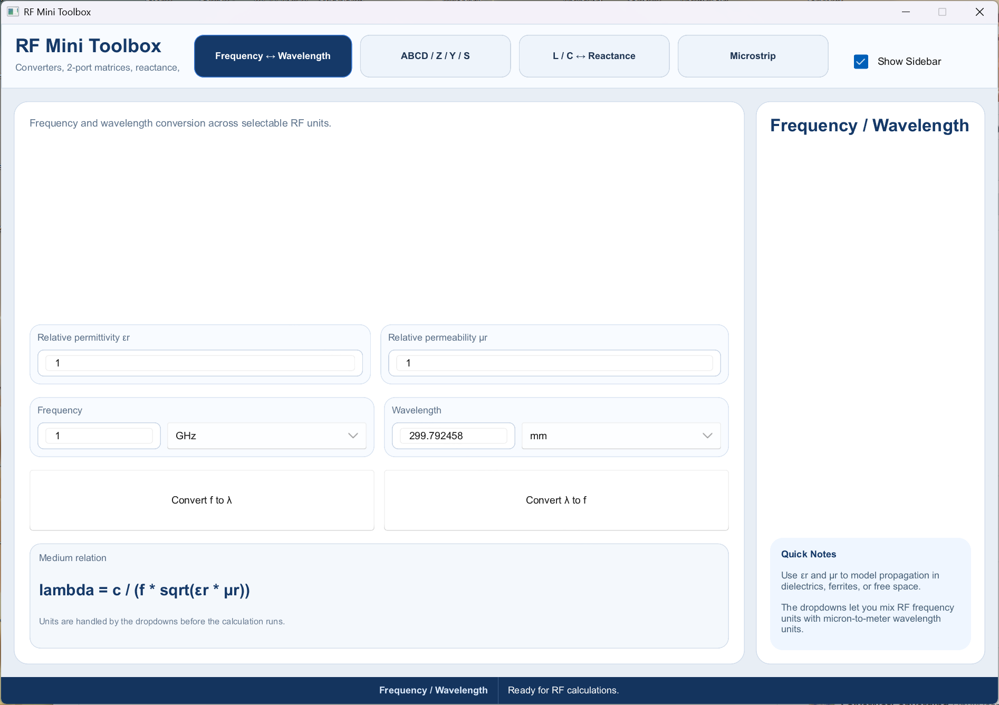
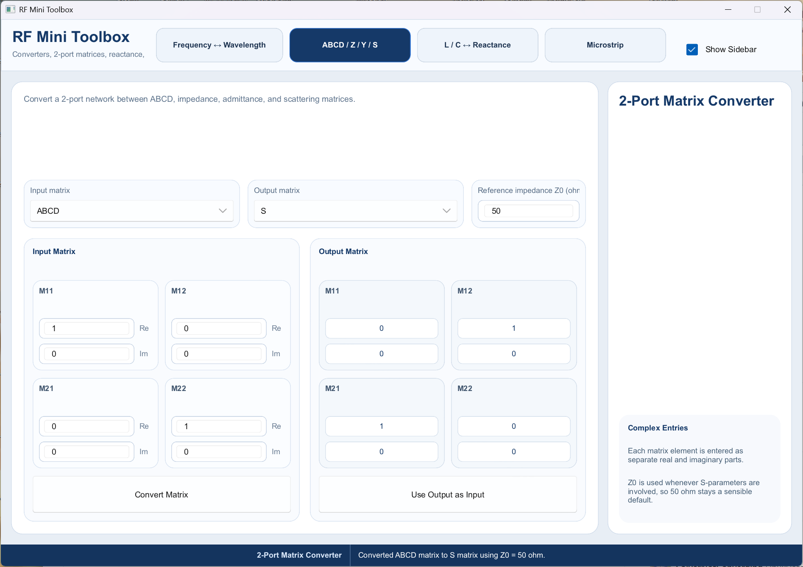
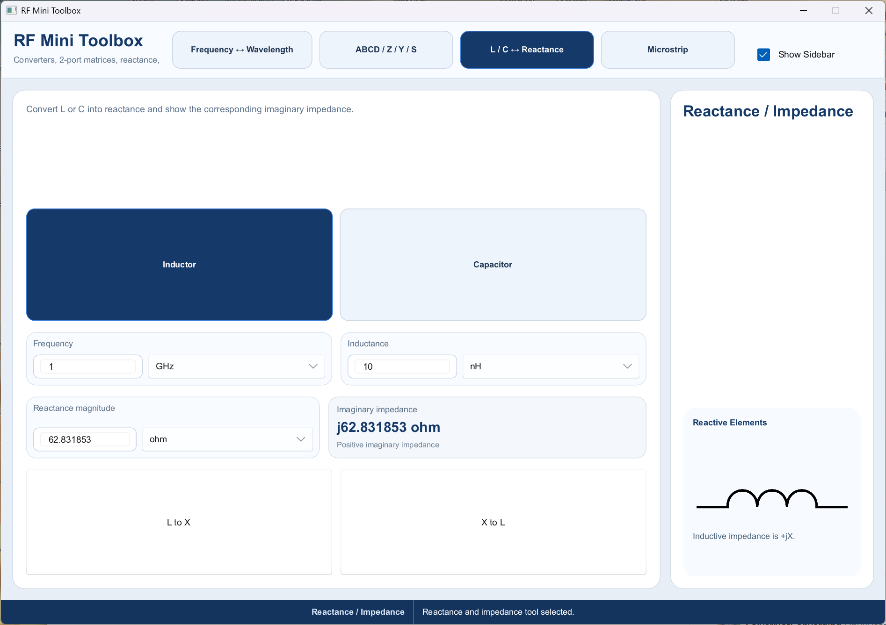
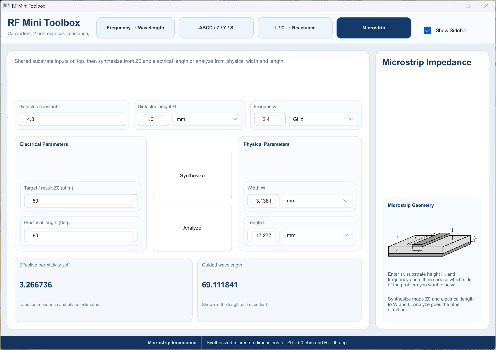

# RF Mini Toolbox

For a ready-to-run Windows build, use `slint_project.exe` in the project root.
It is copied from `target/release/slint_project.exe` for convenience.

RF Mini Toolbox is a small desktop RF and microwave utility built with Rust and
[Slint](https://slint.dev/). It bundles a few common engineering calculations
into a single GUI application:

- Frequency to wavelength conversion with configurable relative permittivity and
  permeability
- 2-port matrix conversion between ABCD, Z, Y, and S forms
- Inductor/capacitor to reactance conversion
- Microstrip synthesis and analysis estimates

## Screenshots

### Frequency / Wavelength



### 2-Port Matrix Converter



### Reactance Tool



### Microstrip Tool



## Tech Stack

- Rust 2021
- [Slint 1.6](https://slint.dev/) for the desktop UI
- `num-complex` for complex matrix math

## Running

Make sure you have a current Rust toolchain installed, then run:

```bash
cargo run
```

The build script compiles the Slint UI from `ui/app-window.slint` before the
application starts.

## Building A Release Binary

```bash
cargo build --release
```

The compiled binary will be placed under `target/release/`.

## Project Layout

```text
.
|- Cargo.toml
|- build.rs
|- demo_screenshot/
|- src/
|  `- main.rs
`- ui/
   |- app-window.slint
   `- symbols/
```

## What The App Includes

### 1. Frequency / Wavelength

Converts between frequency and wavelength while accounting for the propagation
medium using relative permittivity (`er`) and relative permeability (`ur`).

### 2. 2-Port Matrix Converter

Accepts complex 2x2 entries and converts between:

- ABCD
- Z
- Y
- S

When S-parameters are involved, the app uses a configurable reference impedance
with `50 ohm` as the default.

### 3. Reactance Tool

Converts:

- inductance to reactance
- capacitance to reactance
- reactance back to the corresponding component value

The UI also shows the equivalent imaginary impedance form.

### 4. Microstrip Tool

Provides simple microstrip calculations for:

- synthesizing physical width/length from target impedance and electrical length
- analyzing impedance and electrical length from physical geometry

Inputs include dielectric constant, substrate height, and frequency.

## License

This project is licensed under the MIT License. See [LICENSE](LICENSE).
